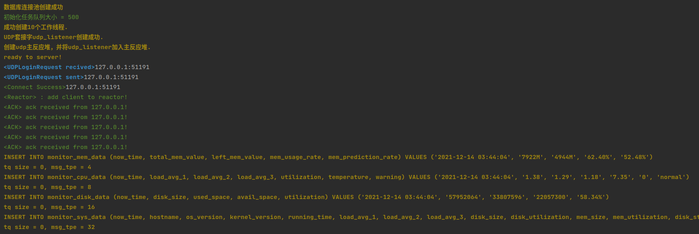
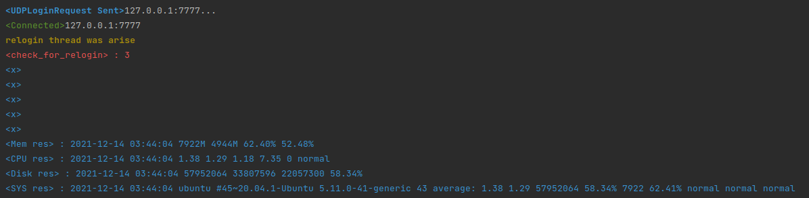

# monitor_system

一个分布式的监控系统，采用CS架构

### Client：

1. 数据收集：、内存信息、cpu信息、磁盘信息。编写shell脚本获取本地数据。每隔几秒通过popen执行shell脚本并获取执行结果。
2. 数据传输：使用CJson。客户端将数据封装到CJSON中、服务端对CJson对象进行解析。
3. 接入系统：tcp连接+token验证
4. 心跳机制：接收到客户端发来的心跳包后，回复一个ACK，证明自己在线。
5. 重连机制：如果3次给服务器发送数据失败，尝试重连
6. 报警信息使用udp传输协议紧急：通过connect函数进行四元组绑定，获得与服务端进行通信的socket，一旦绑定，这个socket只能收到服务端的消息。
7. 数据本地存储：如果连接不到服务器，就将数据存储在本地文件中，等连接到服务器在统一传输。

### Server：

1. 创建TCP主反应堆，主反应堆负责验证，从反应堆+简化版线程池完成具体事件处理。（线程池不具有动态调整能力，可以设置为CPU的核数）
2. 创建udp主反应堆，负责紧急事件处理，通过connet函数模拟TCP的accept函数，完成[源ip、源端口、目的ip、目的端口]四元组的绑定，将绑定成功的socket加入udp反应堆中
3. 数据存储：将数据存储到mysql数据库中。使用 https://blog.csdn.net/qq_36359022/article/details/78771282 博客中的连接池
4. 心跳机制：利用信号量实现每隔几秒给所有的客户段发送一次心跳信息，实现剔除故障节点功能。

### 运行结果：

服务端

客户端：

测试客户端断线后，客户端的重连机制、数据本地存储、本地数据重新传输。 服务端根据心跳机制 会剔除断开连接的客户端
测试方法：取消 login.cpp文件中的 relogin函数中的  两行注释//close(sockfd); // sleep(7);
        取消 collect_local_data.cpp文件中的 check_for_mem函数中的 最后一行注释 //try_to_relogin();
        重新编译 运行程序

